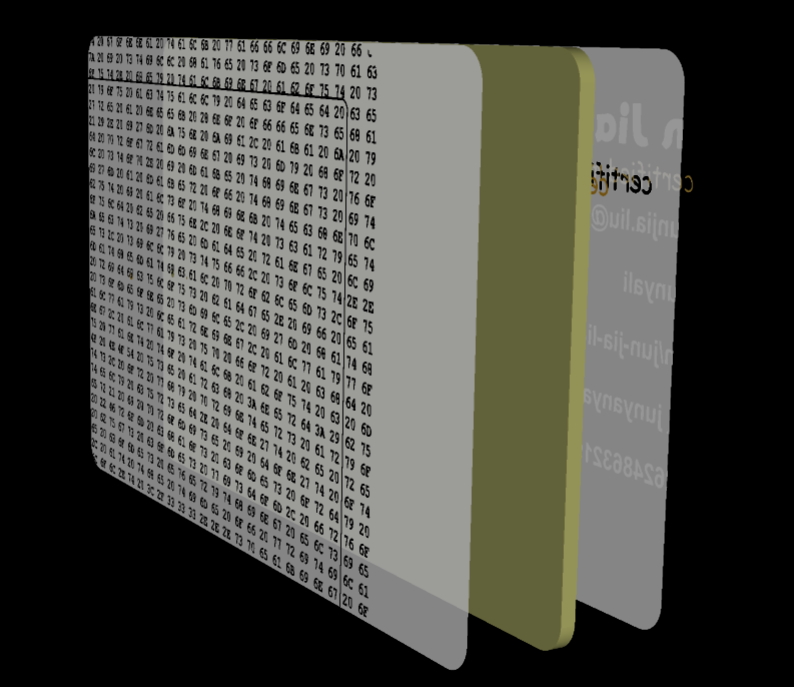

----
Total Time Spent: around 8 hours give or take

# Junyabadge

## Entry 1 - 2025/07/02

okay so i've always wanted a sort of business card that i could just hand to anyone and they would have all the info to contact me, get to me know, etc. business cards are too boring tho, too "corporate"-y, then i realised i could make a business card, not on paper, but on a pcb. to add some spice on top of that, it would have an NFC chip with an antenna, so you can scan it with an NFC reader (your phone) and it would transmit my info to you :3. also maybe LEDs to light up as well.

and thus my hacker badge - "junyabadge", begins...

## Entry 2 - 2025/07/03

okay maybe i didnt start yesterday, but i decided to try out EasyEDA instead of using KiCAD because trying new things out is cool, but also i wanted to try out the integration with JLCPCB parts and LCSC (its amazing btw). bit of a learning curve, doesnt really help that EasyEDA Pro Desktop and EasyEDA Web have vastly different interfaces, but i got through there (still used to KiCAD keybinds T-T).

i used pretty much the same parts to what onboard did for their pcb cards, only that i wanted to add some extra LEDs, because a single yellow LED that lights up when you tap the NFC chip is boring. so i decided to approach with a traffic light LED combo (red, amber, green!!). my electrical knowledge may not be the best, but 47 ohms was too little resistance so the voltage would drop, therefore no lights :(. i did some maths and found 330 ohms to be optimal (wont dim the LEDs too much) but i guess JLCPCB didnt have any specific resistors at that level so i settled for 150 ohms.

LEDs and resistors wired in series, multiples of them in parallel!

now we move onto the pcb!! :yay:

im so used to KiCAD movement and snapping etc, so it was a bit of a wiggle moving everything by doing complex measurements and setting the positions manually, but i somehow managed to make a credit card-sized edge cut with 3.18mm radii corners

routing in EasyEDA was pretty straightforward, the auto router worked first time for me (then i made some manual adjustments because the tracks were uncomfortably close to pads for me). also added a contactless logo in middle of the antenna since it looks cool.

okay so its a hacker badge right? didnt really put any thought into what i would put, so i downloaded icons off fontawesome and use them as socials kind of thing.

woooh! but wait, i've kind of left out the bottom layer in terms of art or silkscreen design, so i thought i'd get creative with it and well...

good luck decoding that!

anyways, final product below (and woah, i'm surprised the design process took me only a day). pretty snazzy :3

(help how do i switch faces or plane axis in easyeda 3d viewer))
