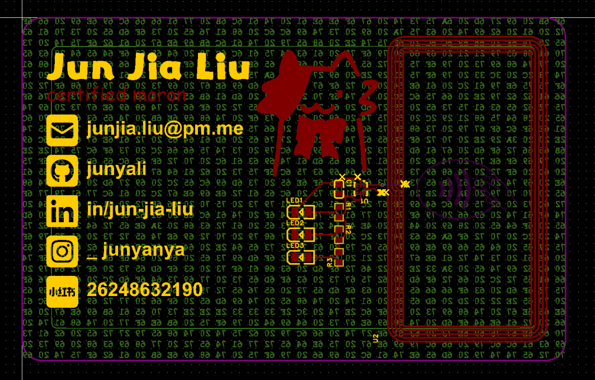

# Junyabadge

A credit card-sized hacker badge with an NFC chip to transmit my 'hacker profile' and light up some LEDs. Comes with a decoding challenge :3

PCB designed in EasyEDA Pro (first time using it :p).

## Preview

| Description | Image                              |
|-------------|------------------------------------|
| Schematic   |         |
| PCB         |               |
| PCB Render  |  |
| PCB Expose  |            |

## BOM

| Manufacturer Part      | Quantity | JLCPCB Price (US$) | Total Price (US$) | Supplier Part | Supplier Link                                                                                                                    |
|------------------------|----------|--------------------|-------------------|---------------|----------------------------------------------------------------------------------------------------------------------------------|
| CL10B224KA8NNNC        | 1        | 0.0008             | 0.0008            | C21120        | https://lcsc.com/product-detail/Multilayer-Ceramic-Capacitors-MLCC-SMD-SMT_Samsung-Electro-Mechanics-CL10B224KA8NNNC_C21120.html |
| KT-0805R               | 1        | 0.0015             | 0.0015            | C2295         | https://lcsc.com/product-detail/LED-Indication-Discrete_Hubei-KENTO-Elec-KT-0805R_C2295.html                                     |
| KT-0805Y               | 1        | 0.0018             | 0.0018            | C2296         | https://lcsc.com/product-detail/LED-Indication-Discrete_Hubei-KENTO-Elec-KT-0805Y_C2296.html                                     |
| KT-0805G               | 1        | 0.0016             | 0.0016            | C2297         | https://lcsc.com/product-detail/LED-Indication-Discrete_Hubei-KENTO-Elec-KT-0805G_C2297.html                                     |
| 0603WAF1500T5E         | 3        | 0.0002             | 0.0002            | C22808        | https://lcsc.com/product-detail/Chip-Resistor-Surface-Mount_UNI-ROYAL-Uniroyal-Elec-0603WAF1500T5E_C22808.html                   |
| NT3H2111W0FHKH         | 1        | 0.1233             | 0.1233            | C710403       | https://lcsc.com/product-detail/RFID-ICs_NXP-Semicon-NT3H2111W0FHKH_C710403.html                                                 |
| N/A                    | 1        | 0                  | 0                 | N/A           | N/A                                                                                                                              |
| PCB Assembled (JLCPCB) | 5        | 21.26              | 21.26             | N/A           | https://jlcpcb.com                                                                                                               |

*Note: Final price is US$21.26*
